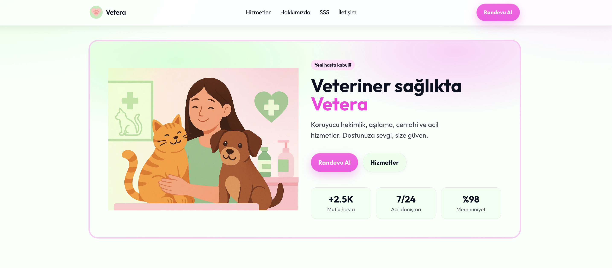
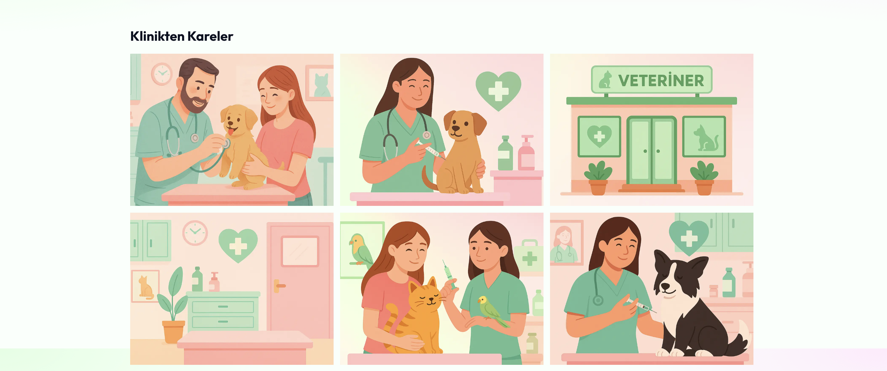
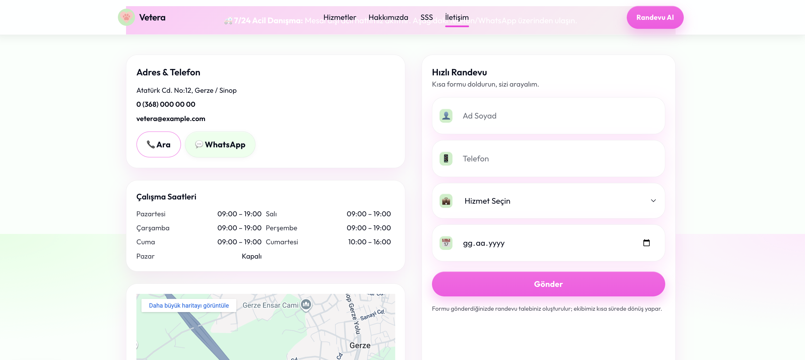

<h1 align="center">
  
  <br>
  🐾 Vetera.Web — Veteriner Kliniği Web Sitesi
</h1>

<p align="center">
  <strong>Sevgiyle bakım, güvenle tedavi.</strong><br>
  Modern veteriner klinikleri için geliştirilen <b>Next.js + Tailwind CSS + TypeScript</b> tabanlı profesyonel web sitesi.
</p>

<p align="center">
  
  
  
  
  
  
</p>

---

## 🌟 Proje Özeti

**Vetera.Web**, evcil dostlar için hizmet veren veteriner klinikleri ve pet hastaneleri için geliştirilmiş modern bir tanıtım ve randevu web sitesidir.  
**Next.js 15 (App Router)** mimarisi, **Tailwind CSS v4** teması ve **TypeScript** yapısı üzerine kurulmuştur.  

Bu repo, **portföy amaçlı bir vitrin projesidir** — kaynak kodu özel (private) olarak korunmaktadır.

---

## ✨ Öne Çıkan Özellikler

| Özellik | Açıklama |
|----------|-----------|
| 🐶 **Evcil Dost Odaklı Tasarım** | Duygusal dil ve sade arayüz ile güven veren kullanıcı deneyimi. |
| 🧭 **Hizmet Kartları + Harita** | Görseller, fiyat aralığı ve konum yönlendirmesiyle zengin içerik. |
| 💬 **Hızlı İletişim Alanı** | WhatsApp ve telefon bağlantılı iletişim butonları. |
| 💅 **Modern Görsel Tema** | Fuşya 💖 + Mint 🌿 renk paletiyle özgün görünüm. |
| 📅 **Randevu Formu** | EmailJS veya backend Server Action ile form gönderimi. |
| 🌙 **Karanlık Tema** | `data-theme="dark"` ile gece modu. |
| 📱 **Mobil Uyumluluk** | Tüm cihazlarda tam responsive grid düzeni. |

---

## 🧩 Kullanılan Teknolojiler

- ⚙️ **Next.js 15 (App Router)**
- 🧠 **TypeScript 5**
- 🎨 **Tailwind CSS v4 + PostCSS**
- 🧭 **Google Maps Embed**
- 💌 **EmailJS** (randevu & iletişim formu)
- 🪶 **Framer Motion**
- 📦 **Lucide Icons**
- 🌗 **Dark Mode Switcher**

---

## 🏗️ Klasör Yapısı

```

Vetera.Web/
├── public/
│   ├── logo-vetera.svg
│   ├── favicon.svg
│   ├── favicon.png
│   └── images/
│       ├── hero.png
│       ├── clinic-1.png
│       ├── clinic-2.png
│       ├── vet-1.png
│       ├── vet-2.png
│       ├── service-exam.png
│       ├── service-vaccine.png
│       ├── service-surgery.png
│       ├── service-dental.png
│       ├── service-parasite.png
│       ├── service-chip.png
│       └── map-preview.png
│
├── src/app/
│   ├── page.tsx
│   ├── services/page.tsx
│   ├── about/page.tsx
│   ├── faq/page.tsx
│   ├── contact/page.tsx
│   ├── actions/appointment.ts
│   ├── lib/email.ts
│   └── globals.css
└── README.md

````

---

## 🖼️ Arayüz Görselleri

| Bölüm | Görsel |
|-------|---------|
| 🏠 Ana Sayfa |  |
| 💉 Hizmetler |  |
| 📸 Galeri |  |
| 💬 İletişim |  |

> Görseller demo amaçlıdır. Tüm hakları © **Açelya Ünal**’a aittir.

---

## 💡 Proje Amacı

Kliniklerin, veterinerlerin ve pet bakım merkezlerinin profesyonel, sade ve güven veren bir web sitesine sahip olmasını kolaylaştırmak.  
**Vetera.Web**, hem bilgi hem randevu süreçlerini tek çatı altında toplar.  
Modern, hızlı ve kullanıcı dostu yapısıyla markaya prestij kazandırır.

---

## ⚙️ Teknik Özellikler

- Server Actions destekli randevu gönderimi  
- Tailwind `@theme` değişken sistemi (`--brand`, `--accent`)  
- Responsive grid (`max-w-6xl`, `gap-6`)  
- Sticky navbar + shadow efekti  
- `globals.css` içinde tema değişkenleri  
- Google Maps embed + “Yol Tarifi” butonları  
- `layout.tsx` → `data-brand="vetera"` çoklu tema desteği  

---

## 🔧 Kurulum

```bash
# 1️⃣ Bağımlılıkları yükle
npm install

# 2️⃣ Geliştirme modunda başlat
npm run dev

# 3️⃣ Production build
npm run build && npm start
````

### Ortam Değişkenleri (.env.local)

```bash
NEXT_PUBLIC_BRAND=vetera
NEXT_PUBLIC_BASE_URL=http://localhost:3000

EMAIL_SERVICE_ID=service_xxx
EMAIL_TEMPLATE_ID=template_xxx
EMAIL_PUBLIC_KEY=xxx
```

---

## 🔒 Lisans ve Kullanım

Bu proje **portföy amaçlıdır**.
Kaynak kodu özel repoda tutulur ve izinsiz olarak kopyalanamaz veya dağıtılamaz.
Tasarım, metinler ve görseller **Açelya Ünal**’a aittir.

> Kod erişimi veya işbirliği için [iletişime geçin](mailto:acelyaunal1@hotmail.com).

© 2025 Açelya Ünal — Tüm hakları saklıdır.

---

## 💌 İletişim

📧 **E-posta:** [acelyaunal1@hotmail.com](mailto:acelyaunal1@hotmail.com)
💼 **GitHub:** [github.com/acelyaunal](https://github.com/acelyaunal)
🐾 **Proje:** [github.com/acelyaunal/Vetera.Web](https://github.com/acelyaunal/Vetera.Web)

---

<p align="center">
  
  <br>
  <sub>Made with 💖 and Tailwind by Açelya Ünal</sub>
</p>

